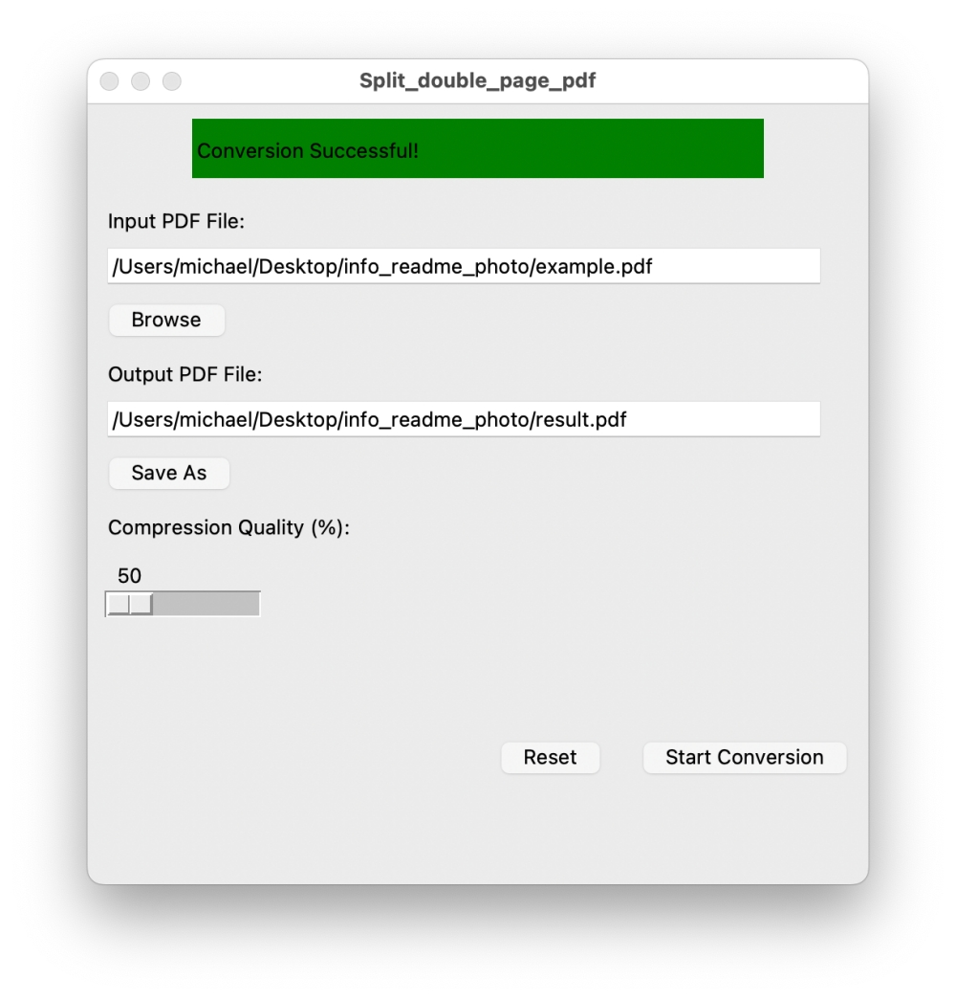

# split_double_page_pdf - 2장보기 PDF를 좌우로 나누기

## 목차
1. [소개](#소개)
2. [주요 기능](#주요-기능)
3. [사용 방법](#사용-방법)
   - [Python 설치](#python-설치)
   - [필요한 라이브러리 설치](#필요한-라이브러리-설치)
   - [프로그램 실행](#프로그램-실행)
   - [프로그램 사용](#프로그램-사용)
4. [Mac용 실행 파일 생성](#mac용-실행-파일-생성)
   - [PyInstaller 설치](#pyinstaller-설치)
   - [실행 파일 생성](#실행-파일-생성)
   - [결과물 확인](#결과물-확인)
5. [시스템 요구사항](#시스템-요구사항)
6. [문제 해결](#문제-해결)
7. [라이선스](#라이선스)

---

## 소개
**split_double_page_pdf**는 2장보기 형식의 PDF 파일을 가운데 기준으로 좌우 페이지로 나누고, 이를 하나의 PDF 파일로 저장할 수 있는 GUI 프로그램입니다. MacBook에서 사용하기 쉽게 설계되었으며, 간단한 버튼 조작만으로 작업을 완료할 수 있습니다.

---

## 주요 기능
1. **원본 PDF 파일 선택**: 2장보기 형식의 PDF 파일을 입력합니다.
2. **변환된 PDF 저장**: 분할된 PDF 파일의 저장 경로를 설정합니다.
3. **변환 버튼 클릭**: 변환 작업을 시작합니다.

---

## 사용 방법

### Python 설치
MacBook에 Python 3.12 이상이 설치되어 있어야 합니다.  
[Python 다운로드](https://www.python.org/downloads/)

---

### 필요한 라이브러리 설치
아래 명령어로 필요한 라이브러리를 설치하세요:
```bash
pip install PyPDF2 Pillow
```

---

### 프로그램 실행
아래 명령어로 프로그램을 실행하세요:
```bash
python split_double_page_pdf.py
```

---

### 프로그램 사용

#### .app 파일 실행 방법
1. 실행파일 폴더 내 **dist** 폴더를 확인합니다.
2. **split_double_page_pdf** 앱을 실행합니다.
3. 화면을 확인하고 아래 .py 설명을 참고하여 순서대로 진행합니다.

#### .py 파일 실행 방법
1. **Input PDF File** 버튼을 클릭하여 원본 PDF 파일을 선택합니다.

2. **Output PDF File** 버튼을 클릭하여 저장할 파일 경로를 설정합니다.

3. **Start Conversion** 버튼을 눌러 변환을 시작합니다.

4. 변환이 완료되면 성공 메시지가 표시됩니다.  



#### 결과 확인
- 변환 전 >> 페이지당 2페이지로 구성 된 PDF
  
- 변환 후 >> 페이지당 1페이지로 구성 변환 완료 PDF  

- 추가 문제시 **split_double_page_pdf.log** 로그 파일을 찾아 확인해봅니다.

---

## Mac용 실행 파일 생성

### PyInstaller 설치
아래 명령어로 PyInstaller를 설치합니다:
```bash
pip install pyinstaller
```

---

### 실행 파일 생성
아래 명령어를 실행하여 `.app` 파일을 생성합니다:
```bash
pyinstaller --noconfirm --onefile --windowed --name "split_double_page_pdf" split_double_page_pdf.py
```

---

### 결과물 확인
명령 실행 후 `dist/` 폴더에 `split_double_page_pdf.app` 파일이 생성됩니다. 이 파일을 실행하면 프로그램이 시작됩니다.

---

## 시스템 요구사항
- Python 3.12 이상
- macOS (권장)

---

## 문제 해결
- **Python이 설치되지 않음**: [Python 공식 웹사이트](https://www.python.org/downloads/)에서 설치하세요.
- **라이브러리 설치 오류**: `pip install` 명령어를 다시 실행하세요.
- **실행 파일 오류**: PyInstaller를 최신 버전으로 업데이트 후 다시 시도하세요:
  ```bash
  pip install --upgrade pyinstaller
  ```

---

## 라이선스
이 프로젝트는 MIT 라이선스를 따릅니다.
```